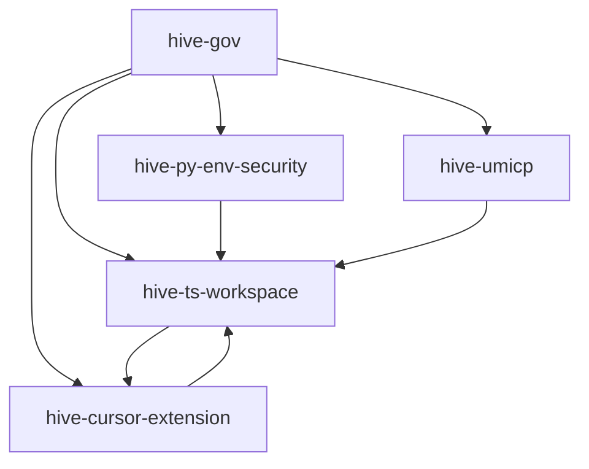

# 🗺️ HiveLLM Ecosystem Map

## 📊 Complete Repository Distribution

### 🏛️ **hive-gov** - Governance Center
**Purpose**: Central governance hub with all BIP specifications and processes
- **Location**: `./hive-gov/`
- **Technology**: Markdown documentation
- **Contains**: BIP specs (00-05), minutes, proposals, guidelines, team structure
- **Role**: Democratic decision-making center for the entire ecosystem

### 🔷 **hive-ts-workspace** - TypeScript Implementation Hub  
**Purpose**: Multi-BIP TypeScript implementation workspace
- **Location**: `./hive-ts-workspace/`
- **Technology**: TypeScript + Turborepo + Vitest
- **Contains**: BIP-01 (voting), BIP-02 (crypto), BIP-03 (resilience)
- **Packages**: 5 production-ready packages with 74+ tests
- **Role**: Core development infrastructure for TypeScript-based BIPs

### 🎯 **hive-cursor-extension** - IDE Automation
**Purpose**: Cursor IDE extension for governance workflow automation
- **Location**: `./hive-cursor-extension/`  
- **Technology**: TypeScript + VSCode Extension API
- **Contains**: BIP-00 (governance automation)
- **Features**: Minute generation, automated voting, BIP management
- **Role**: Developer experience and workflow automation

### 🔒 **hive-py-env-security** - Security Environment
**Purpose**: Secure script execution with comprehensive security controls
- **Location**: `./hive-py-env-security/`
- **Technology**: Python 3.8+ with security frameworks
- **Contains**: BIP-04 (secure script execution)
- **Features**: Sandboxing, resource limits, audit logging, security monitoring
- **Role**: Secure execution environment for governance scripts

### 🌐 **hive-umicp** - Communication Protocol
**Purpose**: Universal communication protocol for AI model interoperability
- **Location**: `./hive-umicp/`
- **Technology**: C++17 core with 5 language bindings
- **Contains**: BIP-05 (communication protocol)
- **Features**: High-performance messaging, encryption, compression
- **Role**: Inter-model communication infrastructure

## 🔄 **Repository Interdependencies**



### **Dependency Flow**
1. **hive-gov** provides specifications for all other repositories
2. **hive-ts-workspace** provides core TypeScript packages used by extensions
3. **hive-cursor-extension** integrates with TypeScript packages for automation
4. **hive-py-env-security** may use TypeScript packages for integration
5. **hive-umicp** provides communication layer for all components

## 🎯 **Development Workflow**

### **For BIP Specification Work**
```bash
cd hive-gov
# Work with BIP documentation, proposals, governance processes
```

### **For Core Infrastructure Development**
```bash
cd hive-ts-workspace  
# Work with voting system, cryptography, resilience framework
```

### **For IDE Feature Development**
```bash
cd hive-cursor-extension
# Work with governance automation, UI components, extension features
```

### **For Security Implementation**
```bash
cd hive-py-env-security
# Work with secure execution, monitoring, audit systems
```

### **For Protocol Development**
```bash
cd hive-umicp
# Work with communication protocols, language bindings
```

## 📋 **BIP Implementation Matrix**

| BIP | Component | Repository | Technology | Status | Tests |
|-----|-----------|------------|------------|--------|-------|
| **00** | Cursor Extension | `hive-cursor-extension` | TypeScript | 🔄 Dev | In progress |
| **01** | Voting System | `hive-ts-workspace` | TypeScript | ✅ Done | 32/32 ✅ |
| **02** | TypeScript Ecosystem | `hive-ts-workspace` | TypeScript | ✅ Done | Build ✅ |
| **03** | AI Resilience | `hive-ts-workspace` | TypeScript | ✅ Done | 74/74 ✅ |
| **04** | Secure Execution | `hive-py-env-security` | Python | ✅ Migrated | Ready |
| **05** | UMICP Protocol | `hive-umicp` | C++/Multi | ✅ Core Done | 95%+ ✅ |

## 🚀 **Ecosystem Status**

### ✅ **Production Ready**
- **Governance System**: Fully operational democratic decision-making
- **Voting Infrastructure**: Cryptographic consensus with immutable records
- **TypeScript Foundation**: Complete development ecosystem
- **AI Resilience**: Production-ready reliability framework

### 🔄 **In Development**  
- **IDE Integration**: Governance automation in Cursor IDE
- **Cross-Repository Integration**: Seamless workflow between components

### 📈 **Future Enhancements**
- **Web Dashboard**: Real-time governance visualization
- **Mobile Apps**: Governance participation on mobile devices
- **External Integrations**: Integration with external AI services
- **Machine Learning**: Enhanced decision-making algorithms

---

**Ecosystem Overview**: Complete AI governance and development infrastructure  
**Total Repositories**: 6 (5 active + 1 legacy)  
**Implementation Progress**: 83% complete  
**Status**: ✅ **Production Ready Core Infrastructure**
